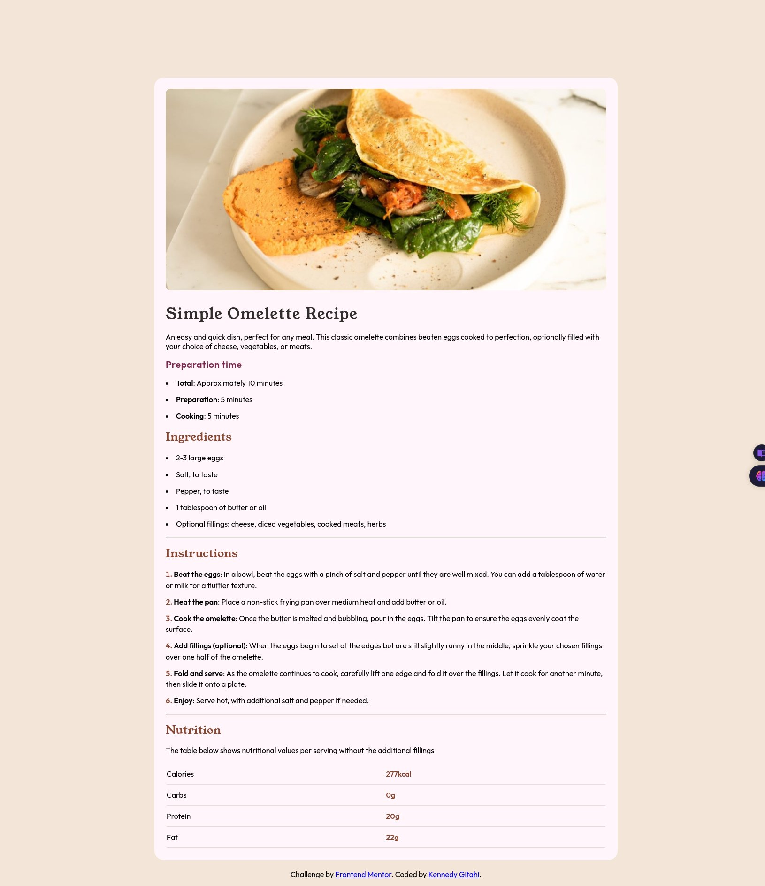

# Frontend Mentor - Recipe page solution

This is a solution to the [Recipe page challenge on Frontend Mentor](https://www.frontendmentor.io/challenges/recipe-page-KiTsR8QQKm). Frontend Mentor challenges help you improve your coding skills by building realistic projects. 

## Table of contents

- [Overview](#overview)
  - [Screenshot](#screenshot)
  - [Links](#links)
- [My process](#my-process)
  - [Built with](#built-with)
  - [What I learned](#what-i-learned)
  - [Useful resources](#useful-resources)
- [Author](#author)

## Overview

### Screenshot



### Links

- Solution URL: [Add solution URL here](https://your-solution-url.com)
- Live Site URL: [Add live site URL here](https://your-live-site-url.com)

 ## Overview

### Built with

- Semantic HTML5 markup
- CSS custom properties
- CSS Grid
- Mobile-first workflow

### What I learned

The main thing I learned was how to use nested CSS. I also learned more about semantic HTML, including when and where to use article, header, and main.

CSS nesting example

```css
tr.grid {
  grid-template-columns: 1fr 1fr;
  border-bottom: 1px solid var(--light-grey);
  align-content: center;
  td {
    margin-block: 0.75rem;
    &:nth-child(2) {
      color: var(--nutmeg);
    }
  }
}
```

### Useful resources

- [MDN Docs - Using CSS nesting](https://developer.mozilla.org/en-US/docs/Web/CSS/CSS_nesting/Using_CSS_nesting)
- [Web.dev - Introduction to variable fonts on the web](https://web.dev/articles/variable-fonts) 

## Author

- Frontend Mentor - [@kengitahi](https://www.frontendmentor.io/profile/kengitahi)
- Twitter - [@kennedy_gitahi](https://www.twitter.com/kennedy_gitahi)
